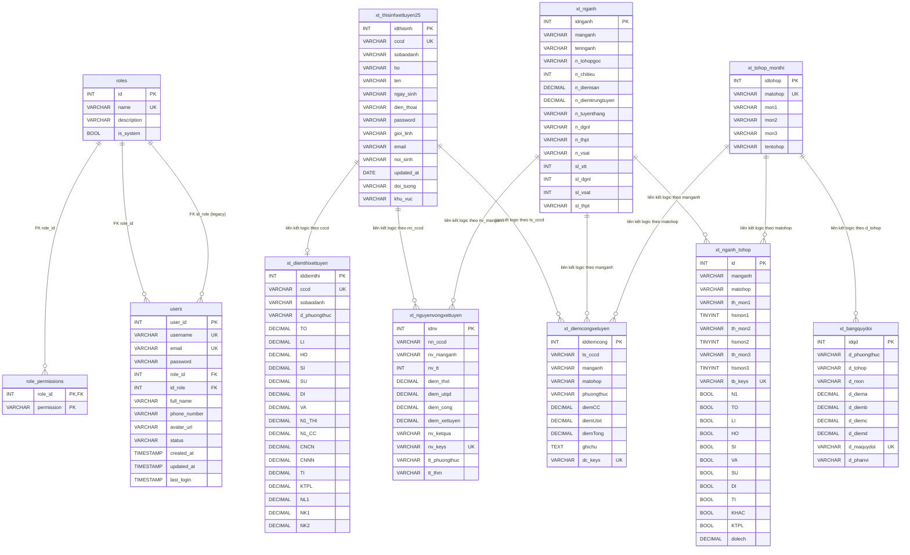

# ERD - Tư vấn tuyển sinh (bám sát đồ án)

Tài liệu này được xây dựng dựa trên:

- Schema trong file SQL được giảng viên cung cấp (nhóm bảng tuyển sinh).
- Model/repository trong đồ án Java (bổ sung cụm bảng phân quyền).

## Sơ đồ Mermaid ERD

    ## Mô hình dữ liệu quan hệ (RDM)

    Mô hình dữ liệu quan hệ của hệ thống được tổ chức thành 2 nhóm chính:

    - Nhóm phân quyền: quản lý tài khoản, vai trò và quyền truy cập.
    - Nhóm tuyển sinh: quản lý thí sinh, điểm thi, ngành, tổ hợp môn, nguyện vọng và bảng quy đổi.

    ### 1. Các quan hệ chính

    | Bảng | Khóa chính | Khóa ngoại / liên kết | Ghi chú |
    |---|---|---|---|
    | roles | id | - | Bảng vai trò hệ thống |
    | role_permissions | (role_id, permission) | role_id -> roles.id | Bảng ánh xạ quyền theo vai trò |
    | users | user_id | role_id -> roles.id; id_role -> roles.id | Tài khoản người dùng |
    | xt_thisinhxettuyen25 | idthisinh | cccd là định danh nghiệp vụ duy nhất | Hồ sơ thí sinh |
    | xt_diemthixettuyen | iddiemthi | cccd liên kết logic với thí sinh | Điểm thi xét tuyển |
    | xt_nganh | idnganh | - | Danh mục ngành |
    | xt_tohop_monthi | idtohop | matohop là mã duy nhất | Danh mục tổ hợp môn |
    | xt_nganh_tohop | id | manganh, matohop liên kết logic | Ánh xạ ngành - tổ hợp |
    | xt_diemcongxetuyen | iddiemcong | ts_cccd, manganh, matohop liên kết logic | Điểm cộng xét tuyển |
    | xt_nguyenvongxettuyen | idnv | nn_cccd, nv_manganh liên kết logic | Nguyện vọng xét tuyển |
    | xt_bangquydoi | idqd | d_tohop liên kết logic | Bảng quy đổi điểm |

    ### 2. Mô tả quan hệ giữa các bảng

    - Một vai trò có thể gán cho nhiều người dùng, nhưng mỗi người dùng chỉ gắn với một vai trò chính thông qua `role_id`.
    - Một vai trò có nhiều quyền truy cập khác nhau trong `role_permissions`.
    - Một thí sinh có thể phát sinh một bản ghi điểm thi và nhiều bản ghi nguyện vọng.
    - Một ngành có thể gắn với nhiều tổ hợp môn thông qua bảng trung gian `xt_nganh_tohop`.
    - Một tổ hợp môn có thể được dùng để quy đổi hoặc xét tuyển cho nhiều ngành.
    - Bảng `xt_diemcongxetuyen` và `xt_nguyenvongxettuyen` dùng các mã nghiệp vụ như CCCD, mã ngành và mã tổ hợp để liên kết dữ liệu giữa các phân hệ.

    ### 3. Đặc điểm mô hình

    - Cụm bảng phân quyền có đầy đủ FK vật lý trong database.
    - Cụm bảng tuyển sinh chủ yếu dùng liên kết logic bằng mã nghiệp vụ, phù hợp với cách nhập dữ liệu và xử lý trong đồ án.
    - Thiết kế này giúp hệ thống dễ mở rộng, đồng thời giữ được tính linh hoạt khi import dữ liệu từ Excel hoặc đồng bộ từ nguồn ngoài.

## Chi tiết các Module

### 1. Module phân quyền (RBAC)
Quản lý tài khoản quản trị và quyền truy cập chức năng trong hệ thống.

- Bảng roles:
    - id: khóa chính vai trò.
    - name: tên vai trò (duy nhất), ví dụ ADMIN, GIAM_THI.
    - description: mô tả vai trò.
    - is_system: đánh dấu vai trò hệ thống.
- Bảng role_permissions:
    - role_id: khóa ngoại tới roles.id.
    - permission: mã quyền (ví dụ USER_VIEW, NGANH_EDIT).
    - Khóa chính kép: (role_id, permission).
- Bảng users:
    - user_id: khóa chính.
    - username, email: duy nhất.
    - role_id: khóa ngoại chính sang roles.id.
    - id_role: khóa ngoại legacy sang roles.id (tồn tại để tương thích dữ liệu cũ).
    - Các trường hồ sơ: full_name, phone_number, avatar_url, status, created_at, updated_at, last_login.

### 2. Module thí sinh
Lưu trữ thông tin hồ sơ thí sinh dùng cho xét tuyển.

- Bảng xt_thisinhxettuyen25:
    - idthisinh: khóa chính.
    - cccd: định danh duy nhất thí sinh trong dữ liệu nghiệp vụ.
    - Các trường cá nhân: ho, ten, ngay_sinh, gioi_tinh, noi_sinh.
    - Các trường liên hệ: dien_thoai, email.
    - Các trường xét ưu tiên: doi_tuong, khu_vuc.

### 3. Module điểm thi
Lưu điểm theo phương thức và các môn thành phần phục vụ tính điểm xét tuyển.

- Bảng xt_diemthixettuyen:
    - iddiemthi: khóa chính.
    - cccd: liên kết logic 1-1 với thí sinh.
    - d_phuongthuc: phương thức điểm (THPT, DGNL, V-SAT...).
    - Các cột điểm môn: TO, LI, HO, SI, SU, DI, VA, TI, KTPL, ...
    - Các cột điểm đặc thù: N1_THI, N1_CC, NL1, NK1, NK2.

### 4. Module ngành tuyển sinh
Quản lý danh mục ngành, chỉ tiêu và ngưỡng xét tuyển theo từng ngành.

- Bảng xt_nganh:
    - idnganh: khóa chính.
    - manganh, tennganh: mã và tên ngành.
    - n_chitieu: chỉ tiêu tuyển sinh.
    - n_diemsan, n_diemtrungtuyen: ngưỡng điểm.
    - Cờ phương thức: n_tuyenthang, n_dgnl, n_thpt, n_vsat.
    - Thống kê theo phương thức: sl_xtt, sl_dgnl, sl_vsat, sl_thpt.

### 5. Module tổ hợp môn
Định nghĩa các tổ hợp môn chuẩn dùng trong xét tuyển.

- Bảng xt_tohop_monthi:
    - idtohop: khóa chính.
    - matohop: mã tổ hợp (duy nhất), ví dụ A00, A01, D01.
    - mon1, mon2, mon3: 3 môn của tổ hợp.
    - tentohop: tên hiển thị tổ hợp.

### 6. Module ánh xạ ngành - tổ hợp
Thiết lập tổ hợp nào được áp dụng cho từng ngành, kèm trọng số môn.

- Bảng xt_nganh_tohop:
    - id: khóa chính.
    - manganh, matohop: liên kết logic tới ngành và tổ hợp.
    - th_mon1, th_mon2, th_mon3: môn chính trong cấu hình.
    - hsmon1, hsmon2, hsmon3: hệ số từng môn.
    - tb_keys: khóa nghiệp vụ duy nhất (manganh_matohop).
    - Cờ môn: N1, TO, LI, HO, SI, VA, SU, DI, TI, KHAC, KTPL.
    - dolech: độ lệch/quy chuẩn bổ sung.

### 7. Module điểm cộng xét tuyển
Quản lý điểm cộng, ưu tiên và tổng điểm theo từng thí sinh-ngành-tổ hợp.

- Bảng xt_diemcongxetuyen:
    - iddiemcong: khóa chính.
    - ts_cccd: liên kết logic tới thí sinh.
    - manganh, matohop: liên kết logic tới ngành và tổ hợp.
    - diemCC, diemUtxt, diemTong: thành phần điểm cộng và tổng.
    - phuongthuc: phương thức áp dụng.
    - dc_keys: khóa nghiệp vụ duy nhất.

### 8. Module nguyện vọng
Lưu danh sách nguyện vọng đăng ký và kết quả xét tuyển của thí sinh.

- Bảng xt_nguyenvongxettuyen:
    - idnv: khóa chính.
    - nn_cccd: liên kết logic tới thí sinh.
    - nv_manganh: mã ngành nguyện vọng.
    - nv_tt: thứ tự nguyện vọng.
    - Các cột điểm: diem_thxt, diem_utqd, diem_cong, diem_xettuyen.
    - nv_ketqua: trạng thái kết quả nguyện vọng.
    - nv_keys: khóa nghiệp vụ duy nhất.
    - tt_phuongthuc, tt_thm: thông tin phương thức/tổ hợp tại thời điểm xét.

### 9. Module bảng quy đổi điểm
Lưu quy tắc quy đổi điểm theo phương thức, tổ hợp và môn.

- Bảng xt_bangquydoi:
    - idqd: khóa chính.
    - d_phuongthuc: phương thức quy đổi.
    - d_tohop: tổ hợp áp dụng.
    - d_mon: môn áp dụng.
    - d_diema, d_diemb: khoảng điểm nguồn.
    - d_diemc, d_diemd: khoảng điểm đích sau quy đổi.
    - d_maquydoi: mã quy đổi duy nhất.
    - d_phanvi: mô tả phân vị/vùng quy đổi.

### Ghi chú triển khai

- Theo file SQL được cung cấp, các bảng tuyển sinh hiện liên kết bằng khóa logic (cccd, manganh, matohop), chưa khai báo FK vật lý.
- Cụm phân quyền đã có FK vật lý đầy đủ trong đồ án (roles, users, role_permissions).
