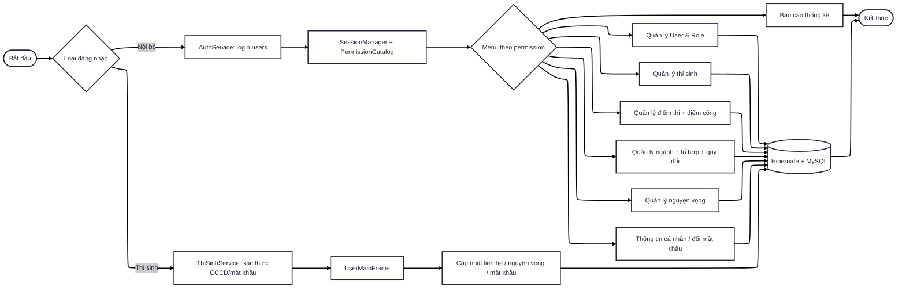
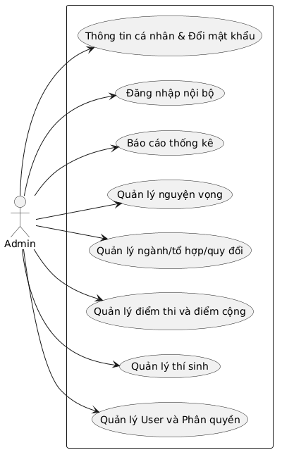
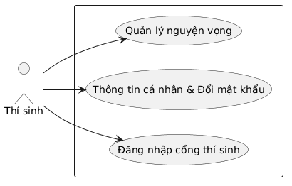
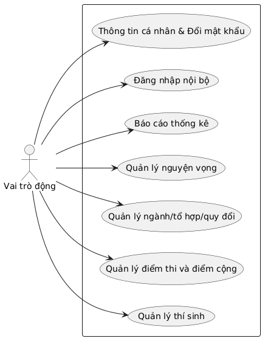
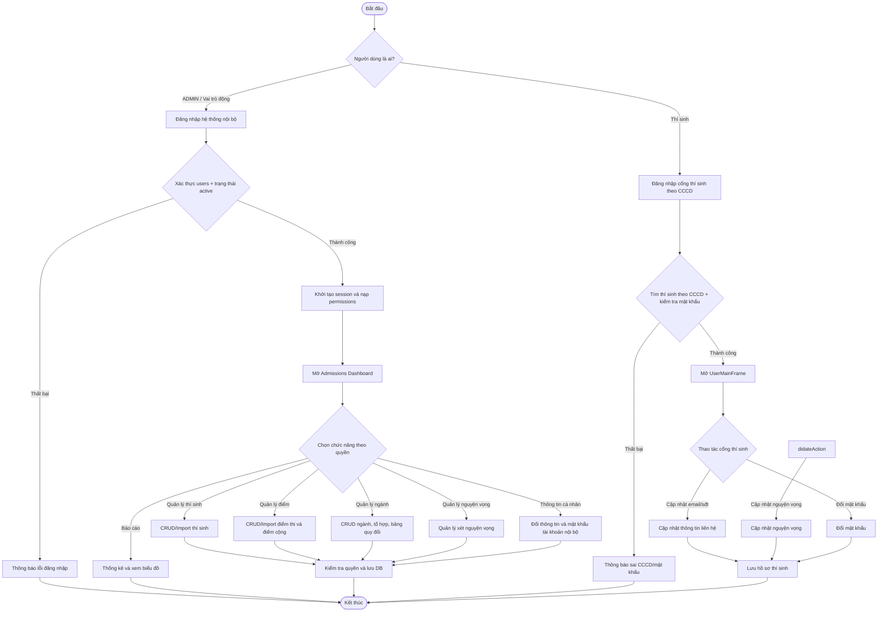
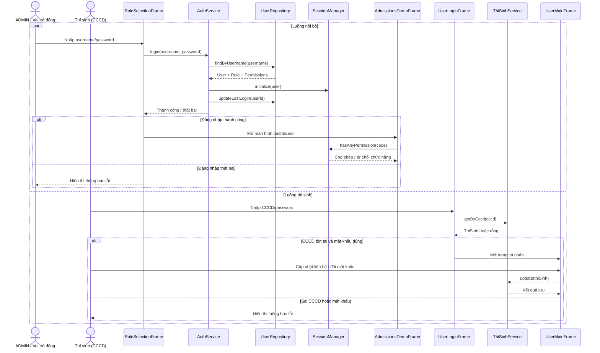
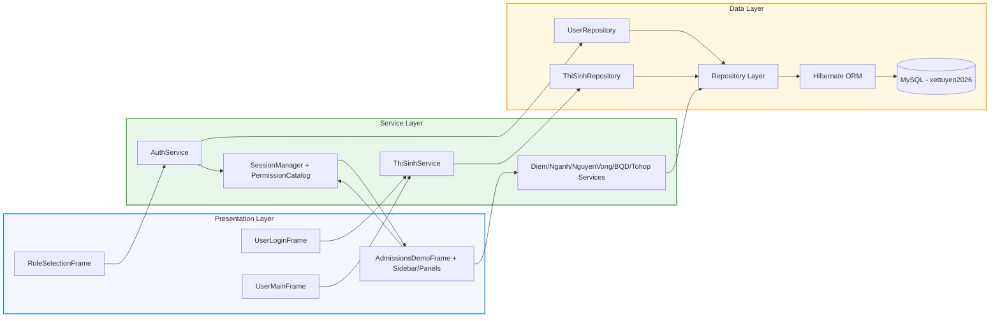

# Product Requirements Document (PRD) - Hệ thống Tư vấn Tuyển sinh SGU 2026

## 1. Tổng quan (Overview)
Hệ thống Tư vấn Tuyển sinh SGU 2026 là ứng dụng desktop Java Swing kết hợp Hibernate ORM, hỗ trợ quản trị dữ liệu tuyển sinh tập trung và cung cấp cổng tra cứu dành cho thí sinh. Nền tảng tập trung vào việc chuẩn hóa dữ liệu thí sinh, ngành tuyển sinh, tổ hợp môn, điểm thi, điểm cộng, nguyện vọng và phân quyền truy cập theo vai trò.

Mục tiêu chính:
- Quản lý đồng nhất dữ liệu tuyển sinh trong một hệ thống duy nhất.
- Hỗ trợ cán bộ tuyển sinh thao tác nhanh qua import Excel và CRUD theo module.
- Cho phép người dùng có tài khoản phù hợp truy cập đúng phạm vi chức năng thông qua RBAC.
- Cung cấp thống kê điểm và phân bố điểm phục vụ phân tích tuyển sinh.

## 2. Đối tượng sử dụng
- Quản trị hệ thống (ADMIN): toàn quyền cấu hình và vận hành.
- Cán bộ nghiệp vụ tuyển sinh (ví dụ GIAM_THI): quản lý dữ liệu thí sinh, điểm, nguyện vọng theo quyền được cấp.
- Thí sinh (HOC_SINH): truy cập cổng cá nhân, xem/cập nhật một phần thông tin và theo dõi dữ liệu liên quan.

## 3. Phạm vi sản phẩm (Product Scope)
### 3.1 In-Scope
- Đăng nhập hệ thống, khởi tạo phiên làm việc và kiểm tra quyền theo role.
- Quản lý danh mục và dữ liệu tuyển sinh cốt lõi:
  - Thí sinh.
  - Điểm thi.
  - Điểm cộng xét tuyển.
  - Ngành tuyển sinh.
  - Tổ hợp môn.
  - Ngành - tổ hợp.
  - Bảng quy đổi.
  - Nguyện vọng.
- Quản trị người dùng nội bộ và phân quyền vai trò.
- Import dữ liệu (nhiều module hỗ trợ import từ Excel).
- Thống kê và báo cáo điểm theo môn/nhóm điểm.

### 3.2 Out-of-Scope (phiên bản hiện tại)
- Cổng web công khai.
- Đồng bộ dữ liệu thời gian thực với hệ thống ngoài.

## 4. Tính năng chính (Key Features)

### 4.1 Xác thực và phân quyền (Authentication & Authorization)
- Đăng nhập theo tài khoản nội bộ (users) và khởi tạo session.
- Điều hướng menu động theo permission của role.
- Kiểm soát truy cập theo từng nhóm quyền:
  - Quản lý người dùng.
  - Quản lý thí sinh.
  - Quản lý điểm.
  - Quản lý điểm cộng.
  - Quản lý ngành và tổ hợp.
  - Quản lý nguyện vọng.
  - Quản lý bảng quy đổi.
  - Báo cáo thống kê.
- ADMIN có khả năng truy cập toàn bộ chức năng.

### 4.2 Quản lý dữ liệu thí sinh (Candidate Management)
- Thêm/Sửa/Xóa hồ sơ thí sinh.
- Tìm kiếm thí sinh theo CCCD và các trường liên quan.
- Import danh sách thí sinh từ file dữ liệu.
- Người dùng thí sinh đăng nhập có thể xem hồ sơ cá nhân và cập nhật thông tin liên hệ.

### 4.3 Quản lý điểm thi và điểm cộng (Scoring Engine)
- Quản lý điểm thi theo nhiều trường môn học, phương thức xét tuyển.
- Quản lý điểm cộng và các thành phần điểm ưu tiên.
- Tính toán và chuẩn hóa dữ liệu phục vụ xét tuyển.
- Import dữ liệu điểm từ file ngoài.

### 4.4 Quản lý ngành, tổ hợp, quy đổi (Academic Catalog)
- Quản lý danh mục ngành tuyển sinh, chỉ tiêu, điểm sàn, điểm trúng tuyển.
- Quản lý tổ hợp môn và ánh xạ ngành - tổ hợp.
- Quản lý bảng quy đổi điểm theo phương thức (THPT, DGNL, V-SAT...).

### 4.5 Quản lý nguyện vọng xét tuyển (Admission Wishes)
- Quản lý danh sách nguyện vọng của thí sinh.
- Theo dõi thứ tự nguyện vọng, điểm xét tuyển và kết quả.
- Hỗ trợ nghiệp vụ xét nguyện vọng theo dữ liệu hiện có.

### 4.6 Báo cáo và thống kê (Reporting)
- Thống kê theo môn (điểm trung bình, cao nhất, thấp nhất, số lượng).
- Thống kê phân bố điểm theo khoảng điểm.
- Hiển thị bảng thống kê và biểu đồ cột phục vụ giám sát dữ liệu.

## 5. Yêu cầu phi chức năng (Non-functional Requirements)
- Hiệu năng:
  - Truy vấn và hiển thị dữ liệu mượt với tập dữ liệu tuyển sinh lớn.
  - Các thao tác CRUD phổ biến phản hồi trong thời gian phù hợp với desktop app nội bộ.
- Độ tin cậy:
  - Dữ liệu nhất quán giữa tầng ORM, repository và database.
  - Hạn chế lỗi nhập liệu bằng kiểm tra dữ liệu đầu vào tại form.
- Bảo mật:
  - Phân quyền chặt theo mã permission.
  - Không cho phép truy cập trái quyền kể cả khi cố tình điều hướng panel trực tiếp.
- Khả năng bảo trì:
  - Tách lớp model/repository/service/view rõ ràng.
  - Dễ mở rộng module mới trong kiến trúc Swing + Hibernate hiện tại.

## 6. Use Case & Activity Diagram

### 6.1 Functional Flowchart

### 6.2 Use Case Diagram

### 6.3 Activity Diagram

### 6.4 Sequence Diagram (Đăng nhập và kiểm tra quyền)

## 7. Kiến trúc vận hành (System Architecture Flow)

## 8. Quy tắc nghiệp vụ chính (Business Rules)
- Chỉ người dùng có permission phù hợp mới được thao tác trên module tương ứng.
- Dữ liệu tuyển sinh liên kết chủ yếu qua khóa nghiệp vụ (CCCD, mã ngành, mã tổ hợp).
- Với thí sinh đăng nhập cổng cá nhân, chỉ được cập nhật nguyện vọng và thông tin liên hệ và mật khẩu của chính mình.
- Báo cáo thống kê chỉ hiển thị khi có đủ dữ liệu đầu vào hợp lệ.
- Tài khoản có trạng thái không active không được đăng nhập.

## 9. Tiêu chí hoàn thành (Acceptance Criteria)
- Người dùng đăng nhập thành công sẽ thấy menu đúng theo quyền được cấp.
- CRUD cho các module chính hoạt động ổn định và lưu đúng vào DB.
- Import dữ liệu cho các module hỗ trợ hoạt động với file hợp lệ.
- Báo cáo thống kê trả về đúng số liệu tổng hợp và biểu đồ hiển thị tương ứng.
- Luồng thí sinh cập nhật thông tin cá nhân và đổi mật khẩu hoạt động.

## 10. Rủi ro & giả định
- Rủi ro:
  - Dữ liệu import không chuẩn định dạng có thể gây sai lệch thống kê.
  - Liên kết logic thay vì FK vật lý ở cụm tuyển sinh yêu cầu kiểm tra dữ liệu kỹ hơn.
- Giả định:
  - CSDL đã seed đúng schema xettuyen2026.
  - Môi trường chạy có Java, Maven và cấu hình Hibernate hợp lệ.
  - Tập quyền role_permissions được cấu hình đầy đủ theo nghiệp vụ từng đơn vị.
